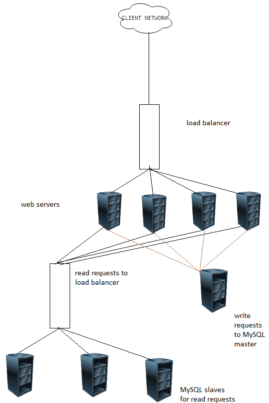

# System-design-cheat-sheet
work to record my progress in the arena of system design

have a look at the repo: https://github.com/Sm2927/system-design-primer#system-design-topics-start-here 
## Workflow
source: https://www.youtube.com/watch?v=-W9F__D3oY4
 
### vertical and horizontal scaling

CLIENT -----(sends request)----- DNS Server (host name to IP address)
 
https://stackoverflow.com/questions/11707879/difference-between-scaling-horizontally-and-vertically-for-databases
 
for horizontal scaling, we need a load balancer- that is a fancy DNS Server which follows a certain algorithm like *Round Robin* to distribute load among the servers or we can have dedicated servers where say, one server dedicated to all html requests and another server handles multimedia like images, gifs, etc

 

**Caching** and **Time-to-live**
 

**Log-in sessions**- storing session data in external hard drives, like a database or a file server, for users so that the servers can share states. 
 

*drawback*- what if the file server fails?
 

*solution* - **RAID**
 

## RAID - Redundant Array of Independent Disks
 
approaches - striping and redundnacy
 

*(**preferably throwing redundnacy to the confines of a single server**)*
 
(necessary concerns - *scalabilty*, *versatility*, *economic*, *response time* )
 

## Sticky sessions
 
On multiple visits to a website, the session somehow gets preserved.
 
MySQL does caching for identically executed queries (which happens when a user is navigating in a website)- can be done with the help of cookies

## CAP
 
CAP theorem states that : while desigining a distributed system, it is impossible to achieve all 3 objectives namely, consistency, availability and tolerance, simultaneously.
 
1. consistency - updated information is available almost as soon as it is updated
 
2. availability - always available for the clients
 
3. partition tolerance - working doesn't stop in case of a communication loss
 
http://ksat.me/a-plain-english-introduction-to-cap-theorem/
 
some good reads
 
https://www.quora.com/What-are-Master-and-Slave-databases-and-how-does-pairing-them-make-web-apps-faster
 
https://medium.com/@Pinterest_Engineering/sharding-pinterest-how-we-scaled-our-mysql%20-fleet-3f341e96ca6f
 
https://en.wikipedia.org/wiki/Paxos_(computer_science) 
 

## Sharding 

 
Sharding is a method of splitting and storing a single logical dataset in multiple databases. By distributing the data among multiple machines, a cluster of database systems can store larger dataset and handle additional requests. Sharding is necessary if a dataset is too large to be stored in a single database.
 

## memcache

(memory cache)-powerful technique-used by fb for years- stores in RAM-implemented in many languages-used since responses from cache requests are faster than that from database queries
 
facebook is more read heavy(than write heavy) as more than 10-20 updates can show on our newsfeed in a minute (which are actually some sort of queries), coz it is unlikely for us to update our own status (write into it) around 10-20 times in the same time (a minute).  
Hence, facebook prefers using memcache (that involves just a look up in the cache or memory), rather than executing heavy database queries. (facebook is dealing with billions of users, scanning the entire database is very costly).
 

## Replication - the concept of master-slave

automatic copies of data in the master is generated in the slaves.
adavntages- ensures backup (master dies- promote a slave to a master-make necessary reconfigurations-it works!), can be used for load balancing, especially for read heavy websites like facebook, select queries can go to slaves for writing, whereas insert, upadte and delete deal with the master (we can have more servers to lighten the load further).

All in all, we have spare and read requests are balanced.
*we can have master-master paradigm too, in which we have 2 masters and write in either of them, and the code gets replicated in the other.*
 

 

In the above diagram, we see 2 major bottlenecks (receive from more than one sources and relay to more than one destinations) , that are the load balancers. If one of these die, all will come to a standstill. So, we need more load balancers for replication(master-master/master-slave) to ensure no abrupt termination occurs. We can also go for partitioning of servers. Facebook used this method. MIT users were alloted a set of servers and so were users of Harvard. *(If there is required to be connection between MIT and Harvard users, separate cross-linking was required, this was a major drawback.)*

 

**High availability (HA)**
is a characteristic of a system, which aims to ensure an agreed level of operational performance, usually uptime, for a higher than normal period.
 
Mostly, this is done by two systems checking each others' heartbeats and if one dies, the other takes over.
 

**We have to avoid single point of failures in the topology**

## Network Redundancy
(having separate data centres at different locations who do not share a common work space)
Network redundancy is a process through which additional or alternate instances of network devices, equipment and communication mediums are installed within network infrastructure. It is a method for ensuring network availability in case of a network device or path failure and unavailability.

**an example :** Suppose my IP has been cached to a particular data center for say, Amazon, and it goes dysfunctional for some calamity or other issue. Due to caching, I am routed to that centre but no operation could take place as the data centre is out of power. And I will have to wait till the TTL for my IP expires and I am routed to some other centre with proper supply. 

## Security

Controlling the type of traffic flow in the topology.
In a scenario, traffic from outer world to the load balancer is restricted to tcp 80 , encrypted http protocols(443) or VPNs. From load balancers to servers, we are concerned with unencrypted data, so just tcp 80 comes to picture. As for servers to databases, we take tcp 3306 that mysql uses as port number by default.

Firewalling capabilities require the various kinds of hardwares, like switches, etc.

## Domain Name System

Domain name (www.google.com) -----translated by DNS----->  IP Address(173.194.115.96)
 
disadvantages-
 
1. introduces delay if there is no proper caching. 
2. managed by larger organizations like ISPs, large companies or the govt. 
3. prone to DDoS attack (users of twitter couldn't access it if its ip address isn't known)
 

